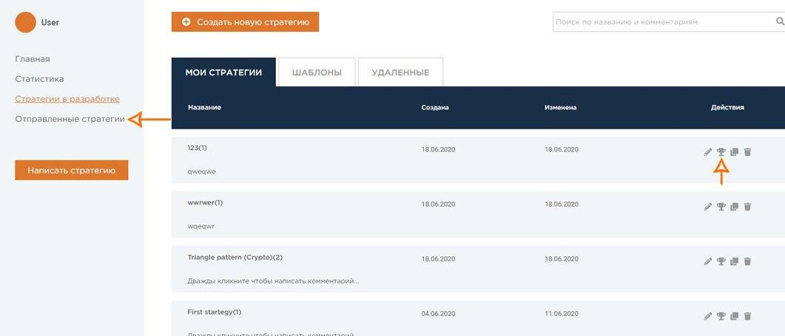

## Editing and submitting strategy

After creating a strategy, you can immediately edit it: add new indicators, adjust parameters, conduct statistical data analysis for developing a trading system, etc. 
As you can see, we provide access to strategy quality control tools. 
Remember that the Sharpe Ratio indicator of any strategy must be greater than 1.0 (for the last 3 years). 
Only then will it pass the platform filters and be able to take part in competitions. You can see all the evaluation criteria [здесь](https://quantnet.ai/contest). 
Have you written a strategy and does it satisfy all the rules? Feel free to submit it, and don't forget to choose competition type. After that, your strategy will automatically move to "Submissions".
 
 