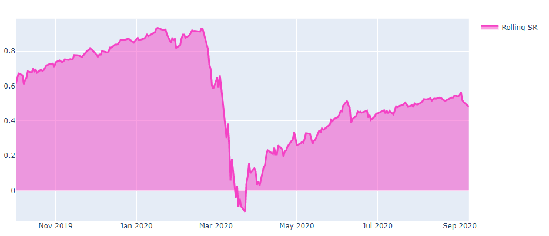

# Evaluation

Once we have constructed an algorithm and plotted an equity on a historical data, we need to use a set of criteria to evaluate the performance. All current competition rules are available [here](https://quantnet.ai/contest).

## Statistics
First, to estimate the profitability of the algorithm, we measure the Sharpe ratio (SR), the most important and popular metric. For our platform, we use the annualized SR and assume that there is ≈252 trading days on average per year. Annualized SR must be at least greater than 1 for the In-Sample test. "calc_stat" function allows to calculate all the statistic of an algorithm.

**Function**
```python
qnt.stats.calc_stat(data, portfolio_history, slippage_factor=0.05, roll_slippage_factor=0.02,
              min_periods=1, max_periods=None,
              per_asset=False, points_per_year=None)
```

**Parameters**

|Parameter|Explanation|
|---|---|
|data|xarray DataArray with market data of the companies your algorithm invests in.|
|portfolio_history|xarray DataArray filled with portfolio weights, corresponding to the investing algorithm.|
|slippage_factor|Transactions are punished with slippage equal to a given fraction of ATR14. We evaluate submissions using 5% of ATR14 for slippage. Read more about slippage [here](https://quantnet.ai/documentation/ru/theoretical_basis.html#id5)|
|roll_slippage_factor| |
|min_periods|minimal number of days|
|max_periods|max number of days for rolling|
|per_asset|calculate stats per asset|
|points_per_year| |

**Output**

The output is xarray with all statistics.

|Output columns|
|---|
|equity|
|relative_return|
|volatility|
|underwater|
|max_drawdown|
|sharpe_ratio|
|mean_return|
|bias|
|instruments|
|avg_turnover|
|avg_holding_time|

**Example**

Assume you chose "buy and hold" strategy and formed output weights:

```python
import qnt.data    as qndata
import datetime as dt
import qnt.stats as qnstats        # key statistics
import qnt.graph as qngraph        # graphical tools
from IPython.display import display
# load historical data
data = qndata.load_data(
                       tail = dt.timedelta(days=4*365),
                       dims = ("time", "field", "asset"),
                       forward_order=True)
is_liquid = data.loc[:,"is_liquid",:].to_pandas()
# set and normalize weights:
weights = is_liquid.div(is_liquid.abs().sum(axis=1, skipna=True), axis=0)
weights = weights.fillna(0.0)
#convert to xarray before statistics calculation
output = weights.unstack().to_xarray()
```

When the weights are formed, one can calculate statistic in order to evaluate algorithm on a historical data:

```python
stat = qnstats.calc_stat(data, output, slippage_factor=0.05)
display(stat.to_pandas().tail())
```

|field <br/> time|	equity|	relative_return|	volatility|	underwater|	max_drawdown|	sharpe_ratio|	mean_return|	bias|	instruments|	avg_turnover|	avg_holding_time|
|---|---|---|---|---|---|---|---|---|---|---|---|
|2020-09-01	|1.547375	|0.007302|	0.213420|	0.000000|	-0.382386|	0.549581|	0.117291|	1.0|	967.0|	0.026296|	83.810199|
|2020-09-02	|1.565288	|0.011577	|0.213385	|0.000000	|-0.382386	|0.564401	|0.120434	|1.0	|967.0	|0.026506	|85.397114|
|2020-09-03|	1.514099|	-0.032703|	0.213932|	-0.032703|	-0.382386|	0.518395|	0.110901|	1.0|	967.0|	0.026526|	85.397114|
|2020-09-04|	1.501310|	-0.008446|	0.213872|	-0.040873|	-0.382386|	0.506844|	0.108400|	1.0|	967.0|	0.026522|	85.397114|
|2020-09-08|	1.472630|	-0.019104|	0.213991|	-0.059196|	-0.382386|	0.480810|	0.102889|	1.0|	967.0|	0.026517|	165.190915|


```python
# show plot with profit and losses:
performance = stat.to_pandas()["equity"]
qngraph.make_plot_filled(performance.index, performance, name="PnL (Equity)", type="log")
```


```python
# show underwater chart:
UWchart = stat.to_pandas()["underwater"]
qngraph.make_plot_filled(UWchart.index, UWchart, color="darkred", name="Underwater Chart", range_max=0)
```


```python
# show rolling Sharpe ratio on a 3-year basis:
SRchart = stat.to_pandas()["sharpe_ratio"].iloc[(252*3):]
qngraph.make_plot_filled(SRchart.index, SRchart, color="#F442C5", name="Rolling SR")
```



## Exposure filter

It is worth to use a few instruments for the trading algorithm. Even if the strategy is right, unpredictable world events/news may cause irreparable damage (for instance, [1](https://www.ft.com/content/be040b3a-5c96-11ea-b0ab-339c2307bcd4) and [2](https://www.themoscowtimes.com/2020/03/06/russias-tinkoff-bank-shares-fall-as-founder-indicted-in-us-a69538)).

A good way to diversify risks is to increase the number of instruments in the investment portfolio. The algorithm can be submitted <ins>only when</ins> it meets the following criterion - the maximum investment in each instrument does not exceed 5 percent of the invested capital.

However, this rule contains concessions aimed at eliminating disputable situations. Below is a more detailed description of the requirement. Let's introduce MP - the maximum percent of the invested capital, distributed per instrument. The exposure filter is passed if one of the conditions is met:
- The MP can be from 5% to 10%  no more than 5 days per year.
- The cumulative excess of the MP for all shares is calculated. The average daily value should not exceed 2 %.

The hard limit is 10%. It means that if MP exceeds 10% your algorithm does not pass the filter.

One can use check_exposure function in order to check this requirement.

**Function**
```python
check_exposure(portfolio_history,
                   soft_limit=0.05, hard_limit=0.1,
                   days_tolerance=0.02, excess_tolerance=0.02,
                   avg_period=252, check_period=252 * 3)
```

**Parameters**

|Parameter|Explanation|
|---|---|
|portfolio_history|output xarray DataArray|
|soft_limit|soft limit for exposure|
|hard_limit|hard limit for exposure|
|days_tolerance|the number of days when exposure may be in range from 0.05 to 0.1|
|excess_tolerance|max allowed average excess|
|avg_period|period for the ratio calculation|
|check_period|period for checking|


**Output**

The output is bool. True indicates successful passing the filter.

