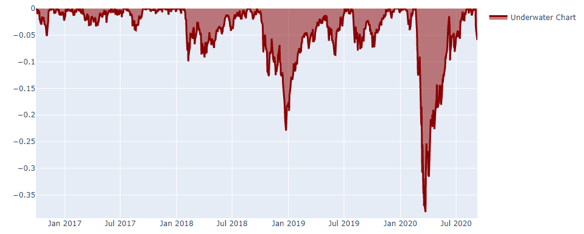

# Evaluation

После того, как мы построили алгоритм и построили график капитала на исторических данных, нам необходимо использовать набор критериев для оценки производительности. Все действующие правила конкурса доступны [здесь](https://quantnet.ai/contest).

## Statistics

Во-первых, чтобы оценить прибыльность алгоритма, мы измеряем коэффициент Шарпа (SR), наиболее используемый и значимый показатель. Для нашей платформы мы используем среднегодовые значения SR и предполагаем, что в среднем в году  ≈252 торговых дня. Годовой SR должен быть как минимум больше 1 для теста In-Sample. Функция «calc_stat» позволяет вычислить всю основную статистику алгоритма.

**Function**
```python
qnt.stats.calc_stat(data, portfolio_history, slippage_factor=0.05, roll_slippage_factor=0.02,
              min_periods=1, max_periods=None,
              per_asset=False, points_per_year=None)
```

**Parameters**

|Parameter|Explanation|
|---|---|
|data|xarray DataArray with market data of the companies your algorithm invests in.|
|portfolio_history|xarray DataArray filled with portfolio weights, corresponding to the investing algorithm.|
|slippage_factor|Transactions are punished with slippage equal to a given fraction of ATR14. We evaluate submissions using 5% of ATR14 for slippage. Read more about slippage [here](https://quantnet.ai/documentation/ru/theoretical_basis.html#id5)|
|roll_slippage_factor| |
|min_periods|minimal number of days|
|max_periods|max number of days for rolling|
|per_asset|calculate stats per asset|
|points_per_year| |

**Output**

Выход функции - xarray DataArray со всей статистикой.

|Output columns|
|---|
|equity|
|relative_return|
|volatility|
|underwater|
|max_drawdown|
|sharpe_ratio|
|mean_return|
|bias|
|instruments|
|avg_turnover|
|avg_holding_time|

**Example**

Предположим, вы выбрали стратегию "buy and hold" и сформировали веса алгоритма:

```python
import qnt.data    as qndata
import datetime as dt
import qnt.stats as qnstats        # key statistics
import qnt.graph as qngraph        # graphical tools
from IPython.display import display
# load historical data
data = qndata.load_data(
                       tail = dt.timedelta(days=4*365),
                       dims = ("time", "field", "asset"),
                       forward_order=True)
is_liquid = data.loc[:,"is_liquid",:].to_pandas()
# set and normalize weights:
weights = is_liquid.div(is_liquid.abs().sum(axis=1, skipna=True), axis=0)
weights = weights.fillna(0.0)
#convert to xarray before statistics calculation
output = weights.unstack().to_xarray()
```

Когда веса сформированы, можно вычислить статистику для оценки алгоритма на исторических данных:

```python
stat = qnstats.calc_stat(data, output, slippage_factor=0.05)
display(stat.to_pandas().tail())
```

|field <br/> time|	equity|	relative_return|	volatility|	underwater|	max_drawdown|	sharpe_ratio|	mean_return|	bias|	instruments|	avg_turnover|	avg_holding_time|
|---|---|---|---|---|---|---|---|---|---|---|---|
|2020-09-01	|1.547375	|0.007302|	0.213420|	0.000000|	-0.382386|	0.549581|	0.117291|	1.0|	967.0|	0.026296|	83.810199|
|2020-09-02	|1.565288	|0.011577	|0.213385	|0.000000	|-0.382386	|0.564401	|0.120434	|1.0	|967.0	|0.026506	|85.397114|
|2020-09-03|	1.514099|	-0.032703|	0.213932|	-0.032703|	-0.382386|	0.518395|	0.110901|	1.0|	967.0|	0.026526|	85.397114|
|2020-09-04|	1.501310|	-0.008446|	0.213872|	-0.040873|	-0.382386|	0.506844|	0.108400|	1.0|	967.0|	0.026522|	85.397114|
|2020-09-08|	1.472630|	-0.019104|	0.213991|	-0.059196|	-0.382386|	0.480810|	0.102889|	1.0|	967.0|	0.026517|	165.190915|


```python
# show plot with profit and losses:
performance = stat.to_pandas()["equity"]
qngraph.make_plot_filled(performance.index, performance, name="PnL (Equity)", type="log")
```


```python
# show underwater chart:
UWchart = stat.to_pandas()["underwater"]
qngraph.make_plot_filled(UWchart.index, UWchart, color="darkred", name="Underwater Chart", range_max=0)
```



```python
# show rolling Sharpe ratio on a 3-year basis:
SRchart = stat.to_pandas()["sharpe_ratio"].iloc[(252*3):]
qngraph.make_plot_filled(SRchart.index, SRchart, color="#F442C5", name="Rolling SR")
```


## Exposure filter

Для торгового алгоритма разумно использовать несколько инструментов. Даже если стратегия верна, непредсказуемые мировые события / новости могут нанести непоправимый ущерб (например, [1](https://www.ft.com/content/be040b3a-5c96-11ea-b0ab-339c2307bcd4) и [2](https://www.themoscowtimes.com/2020/03/06/russias-tinkoff-bank-shares-fall-as-founder-indicted-in-us-a69538)).

Хороший способ диверсифицировать риски - увеличить количество инструментов в инвестиционном портфеле. Алгоритм может быть представлен <ins> только </ins> в том случае, если он соответствует следующему критерию - максимальная сумма вложений в каждый инструмент не превышает 5-ти процентов от инвестированного капитала.

Однако в этом правиле есть послабления, направленные на устранение спорных ситуаций. Ниже приводится более подробное описание данного требования. Введем аббревиатуру МП - максимальный процент от инвестированного капитала, выделяемый на инструмент. Фильтр считается пройденным, если выполняется одно из условий:
- МП может составлять от 5% до 10% портфеля (5%> MSW> 10%) не более 5 дней в году.
- Рассчитывается совокупное превышение МП всех инструментов в портфеле. Среднесуточное значение не должно превышать 2%.

Дополнительно существует жесткий лимит - 10%. Это означает, что если МП превышает 10%, ваш алгоритм не проходит фильтр и отсеивается.

Для проверки данного фильтра можно использовать функцию check_exposure.

**Function**
```python
check_exposure(portfolio_history,
                   soft_limit=0.05, hard_limit=0.1,
                   days_tolerance=0.02, excess_tolerance=0.02,
                   avg_period=252, check_period=252 * 3)
```

**Parameters**
|Parameter|Explanation|
|---|---|
|portfolio_history|output xarray DataArray|
|soft_limit|soft limit for exposure|
|hard_limit|hard limit for exposure|
|days_tolerance|the number of days when exposure may be in range from 0.05 to 0.1|
|excess_tolerance|max allowed average excess|
|avg_period|period for the ratio calculation|
|check_period|period for checking|

**Output**

Выход функции логческая переменная. True указывает на успешное прохождение фильтра.

