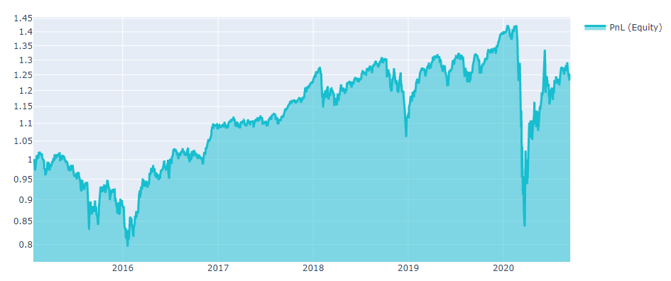
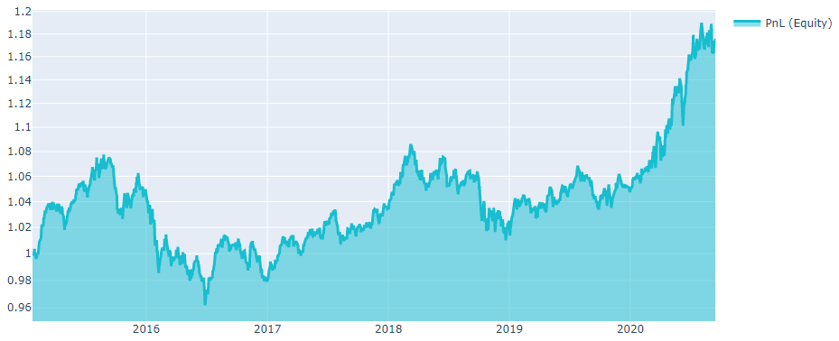

# Improve the strategy

## Neutralization

Мы можем исключить влияние рынка, если уравновесим длинные и короткие позиции для нашего алгоритма. Таким образом, суммарные инвестиции в рынок составят $0. Нейтрализация может быть сделана для всего рынка или для каждого сектора экономики отдельно (в целом для любой группы). Математическая формулировка нейтрализации крайне проста - для каждого дня нужно вычесть среднее значение весов инвестиционного портфеля; полученные веса будут нейтральными к рынку. Более подробную информацию можно найти [здесь](https://quantnet.ai/documentation/en/improve/neutralization.html)

**Function**
```python
qnt.neutralization.neutralize(weights, assets, group = 'market')
```

**Parameters**

|Parameter|Explanation|
|---|---|
|weights|xarray DataArray with weights of the algorithm.|
|assets|qnt.data.load_assets. It is the list of dicts with info for desired tickers.|
|group|str, default='market'. Neutralize positions by 'market', 'industry' or 'sector'.|

**Output**

На выходе получается массив данных xarray с нейтрализованными позициями среди выбранной группы.

**Example**

Рассмотрим реализацию функции нейтрализации на примере инвестиционной стратегии. Каждый алгоритм начинается с загрузки библиотек и данных:

```python
# Basic libraries.
import xarray as xr
import numpy as np
import pandas as pd
import matplotlib.pyplot as plt

# Import quantnet libraries.
import qnt.data    as qndata
import qnt.stats   as qnstats
import datetime    as dt
import qnt.graph   as qngraph
from qnt.neutralization import neutralize
import qnt.data.secgov_indicators
```


```python
# Load all available asset names since the given date.
assets = qndata.load_assets(min_date = '2015-01-01')
assets_names = [i["id"] for i in assets]


data = qndata.load_data(min_date = '2015-01-01',
                        dims=("time", "field", "asset"),
                        assets=assets_names,
                        forward_order=True)

# We trade only liquid stocks
is_liquid = data.loc[:,"is_liquid",:]

# replace zeros in liquid with NaN
index = np.array(abs(is_liquid - 1),dtype = bool)
is_liquid.to_pandas()[index] = np.nan
```

```python
# desired fundamental data
data_lbls = ['ppent']

# One can load corresponding data
fun_data1 = qnt.data.secgov_load_indicators(assets,time_coord = data.time, standard_indicators = data_lbls)
```

```python
# In order to estimate Sharpe for a number of algorithms
def estimate_sharpe(weights_final):
    stat = qnstats.calc_stat(data, weights_final, slippage_factor=0.05)
    days = len(stat.coords["time"])
    returns = stat.loc[:, "relative_return"]

    sharpe_ratio = qnstats.calc_sharpe_ratio_annualized(
        returns,
        max_periods=days,
        min_periods=days).to_pandas().values[-1]

    print(f'Sharpe ratio = {sharpe_ratio}')
```

Допустим, у вас есть идея - составить алгоритм, основанный на показателе "property, plant, and equipment" (PP&E).


```python
weights = fun_data1.sel(field = 'ppent')*is_liquid
weights = weights/abs(weights).sum('asset')
estimate_sharpe(weights)
```

```python
Sharpe ratio = 0.2009557067119658
```

PP&E может увеличиваться или уменьшаться в зависимости от рыночной ситуации и экономических условий. Таким образом, экономическая ситуация в мире повлияет на график PnL (включая глобальные экономические кризисы).

```python
stat = qnstats.calc_stat(data, weights, slippage_factor=0.05)

# show plot with profit and losses:
performance = stat.to_pandas()["equity"].iloc[:]
qngraph.make_plot_filled(performance.index, performance, name="PnL (Equity)", type="log")
```



Снять влияние рынка можно, применив функцию нейтрализации:

```python
output = neutralize(-weights,assets,group = 'market')
estimate_sharpe(output)
```

```python
Sharpe ratio = 0.562002051169064
```

На диаграмме ниже показано, что глобальные кризисы не влияют на поведение PnL для исправленного (нейтрализованного) алгоритма.

```python
stat = qnstats.calc_stat(data, output, slippage_factor=0.05)

# show plot with profit and losses:
performance = stat.to_pandas()["equity"].iloc[:]
qngraph.make_plot_filled(performance.index, performance, name="PnL (Equity)", type="log")
```




## Big exposure improving

Если инвестиционная стратегия не проходит фильтр на максимальный вес инструмента в портфеле, 
можно использовать один из двух вариантов приведенных ниже что бы исправить алгоритм:

```python
import qnt.exposure as qne # расположены в этом пакете
```

### Remove days with high exposures

**Function**
```python
def rm_bad_days(weights, max_weight = 0.049):
```

**Parameters**
|Parameter|Explanation|
|---|---|
|weights|xarray DataArray with weights of the algorithm.|
|max_weight|the maximum stock exposure. Default value  = 0.049|

**Output**

На выходе получается xarray DataArray с исправленными весами, удовлетворяющими критерям фильтра, 
где занулены дни, когда exposure был больше max_weight.

**Example**

```python
fixed_output = qne.rm_bad_days(output)
qnstats.check_exposure(fixed_output)
```


### Mix weights

**Function**
```python
def mix_weights(primary, secondary, max_weight = 0.049):
```

**Parameters**
|Parameter|Explanation|
|---|---|
|primary|xarray DataArray with weights of the algorithm that is need to be improved.|
|secondary|xarray DataArray with weights of the algorithm that passes the maximum stock weight filter.|
|max_weight|the maximum stock exposure. Default value  = 0.049|

**Output**

На выходе получается xarray DataArray с исправленными весами, удовлетворяющими критерям фильтра,
сформированный из смеси весов primary и secondary. 

**Example**

```python 
mean_weights = data.sel(field='is_liquid')
mean_weights = mean_weights/abs(mean_weights).sum('asset')

improved_output = qne.mix_weights(output, mean_weights)

qnstats.check_exposure(improved_output)
```