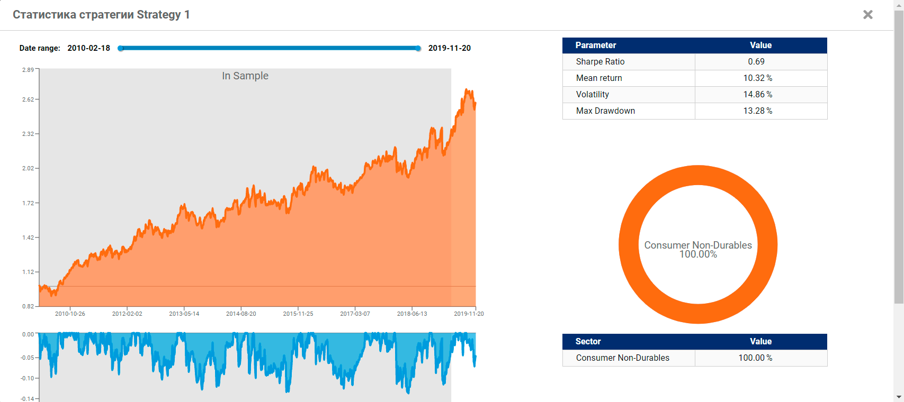

# Отправленные стратегии

Пока ваша стратегия тестируется, она находится на вкладке «На Проверке».
Все стратегии, которые не соответствуют критериям, появятся на вкладке “Отсеянные”. 
Это значит, что стратегия не соответствует какому-то или нескольким критериям. 
В этой вкладке вы также сможете узнать, почему стратегия не была принята к участию, 
прочитав сервисные сообщения. 
Если ваша стратегия удовлетворяет всем [критериям](#), 
она появится на вкладке «Действующие», 
где вы сможете увидеть статистические метрики в реальном времени, 
включая критерий Sharpe Ratio.
Он и используется для ранжирования всех стратегий и определяет места в соревнованиях.

 
Вы можете проверить производительность вашей стратегии на реальных данных онлайн.
Результаты обновляются ежедневно, так что вы можете контролировать изменение 
показателей profit and losses, underwater, long-short bias, sector allocation 
и другие важные показатели, которые используются при оценке качества торгового 
алгоритма.

Все отправленные действующие стратегии будут автоматически участвовать в QuantNet Contest. 
Надеемся, вы обязательно увидите их в списке победителей.