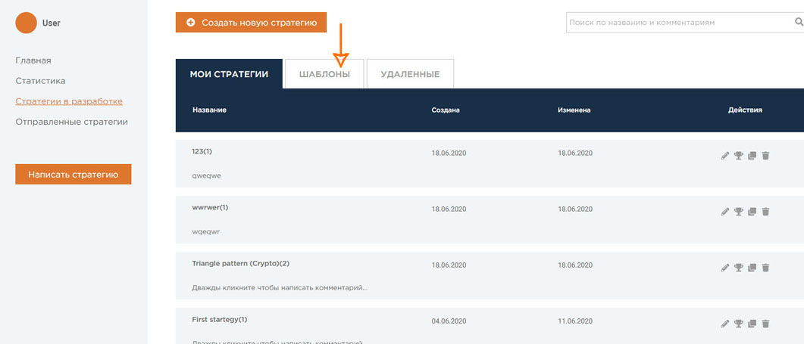

# Шаблоны

На вкладке «Шаблоны» вы найдете бесплатные шаблоны от QuantNet, 
которые можно клонировать и использовать при написании стратегий. 
Такой вариант идеален для новичков и тех, кто начинает свой путь в Data Science. 
Если вы уверены в своих силах, вы можете создать стратегию самостоятельно,
полностью с нуля.

