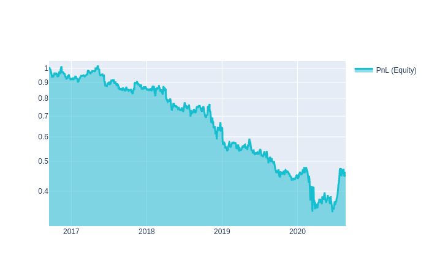
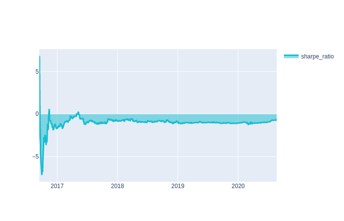
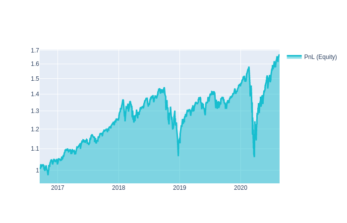

# Быстрый старт

## Что такое QuantNet?

**QuantNet** — компания, которая занимается разработкой инструментов для создания торговых стратегий.

Мы **предоставляем** проверенные **данные с финансовых рынков** и шаблоны уже готовых стратегий, на основе которых пользователи могут создавать собственные алгоритмы.

Мы **предлагаем** пользователям:
* **участвовать в розыгрыше 500 тысяч рублей за квартал**, отправив стратегии в <a href='/contest' target='_blank'>соревнования</a>;
* <a href='https://github.com/qntnet/data-relay' target='_blank'>открытые инструменты</a> для выгрузки **данных** с финансовых **бирж**;
* <a href='https://github.com/qntnet/qnt-python' target='_blank'>открытые инструменты</a> для **создания** торговых **стратегий**. Вы можете **применить их для частной торговли**;
* **протестировать** финансовые **идеи**;
* дружественное комьюнити и **быструю обратную связь**  в <a href='https://vk.com/quantnetrussia' target='_blank'>vk</a>, <a href='https://t.me/quantnetrussia' target='_blank'>Telegram</a>;


> Стратегии создаются на языке **python** или **scala**.
>
Разрабатывайте стратегий в **Jupyter Notebook** или **JupyterLab**.
> **Предоставляем инстансы до 8 гб** оперативной памяти **на** каждую **стратегию.**


## Начало работы
**Цель.** Познакомить вас с тем как создавать и тестировать идеи финансовых стратегий, на примере.

**Необходимые условия.**

* <a class="tip" href='/personalpage/registration' target='_blank'>Зарегистрируйтесь на платформе</a>
* <a class="tip" href='/personalpage/strategies' target='_blank'>Откройте вкладку стратегии в разработке.</a>
<p class="tip">Нажмите <b>создать стратегию</b> или <b>скопируйте</b> любой <b>шаблон</b> готовых стратегий.</p>

### Исторические финансовые данные
Возьмём исторические цены компаний Google и Apple за последние 4*365 дней, отсортированные в хронологическом порядке
```python
import qnt.data as qndata
import datetime as dt

data = qndata.load_data(
                       assets=['NASDAQ:AAPL', 'NASDAQ:GOOGL'],
                       tail = dt.timedelta(days=4*365),
                       forward_order=True)
```

```python
data.sel(field="open").to_pandas().tail()
```

<div>
<style scoped>
    .dataframe tbody tr th:only-of-type {
        vertical-align: middle;
    }

    .dataframe tbody tr th {
        vertical-align: top;
    }

    .dataframe thead th {
        text-align: right;
    }
</style>
<table border="1" class="dataframe">
  <thead>
    <tr style="text-align: right;">
      <th>asset</th>
      <th>NASDAQ:AAPL</th>
      <th>NASDAQ:GOOGL</th>
    </tr>
    <tr>
      <th>time</th>
      <th></th>
      <th></th>
    </tr>
  </thead>
  <tbody>
    <tr>
      <th>2020-08-03</th>
      <td>12118.40</td>
      <td>1491.00</td>
    </tr>
    <tr>
      <th>2020-08-04</th>
      <td>12222.84</td>
      <td>1486.71</td>
    </tr>
    <tr>
      <th>2020-08-05</th>
      <td>12250.28</td>
      <td>1476.82</td>
    </tr>
    <tr>
      <th>2020-08-06</th>
      <td>12365.36</td>
      <td>1476.15</td>
    </tr>
    <tr>
      <th>2020-08-07</th>
      <td>12678.96</td>
      <td>1509.04</td>
    </tr>
  </tbody>
</table>
</div>


### Создание финансовой стратегии
> Стратегии на платформе создаются в виде **весов** от финансового **портфеля**.

Например вы хотите торговать акциями компаний Google и Apple.

* **Сколько процентов** от капитала **инвестировать** в Google, а сколько в  Apple, чтобы заработать завтра? - **задача алгоритма**.

* **Каждый** торговый **день проценты** могут **меняться**. Вы **получаете прибыль**, если угадываете направления цен или **теряете капитал**.

>Идея стратегии. Возьмём абсолютные изменения цен открытия. Цена текущего дня минус цена предыдущего дня.
Получившиеся изменения возьмём как веса активов.


```python
price_open = data.sel(field="open")
strategy = price_open - price_open.shift(time=1)
```
Абсолютные изменения цен:
```python
strategy.to_pandas().tail()
```


<div>
<style scoped>
    .dataframe tbody tr th:only-of-type {
        vertical-align: middle;
    }

    .dataframe tbody tr th {
        vertical-align: top;
    }

    .dataframe thead th {
        text-align: right;
    }
</style>
<table border="1" class="dataframe">
  <thead>
    <tr style="text-align: right;">
      <th>asset</th>
      <th>NASDAQ:AAPL</th>
      <th>NASDAQ:GOOGL</th>
    </tr>
    <tr>
      <th>time</th>
      <th></th>
      <th></th>
    </tr>
  </thead>
  <tbody>
    <tr>
      <th>2020-08-10</th>
      <td>-67.76</td>
      <td>-18.2400</td>
    </tr>
    <tr>
      <th>2020-08-11</th>
      <td>-70.70</td>
      <td>3.2000</td>
    </tr>
    <tr>
      <th>2020-08-12</th>
      <td>-164.78</td>
      <td>-6.8755</td>
    </tr>
    <tr>
      <th>2020-08-13</th>
      <td>440.44</td>
      <td>21.0855</td>
    </tr>
    <tr>
      <th>2020-08-14</th>
      <td>44.66</td>
      <td>5.4000</td>
    </tr>
  </tbody>
</table>
</div>

Превращаем их в веса для нашего портфеля.


```python
weights = strategy / abs(strategy).sum('asset')
```


```python
weights.to_pandas().tail()
```


<div>
<style scoped>
    .dataframe tbody tr th:only-of-type {
        vertical-align: middle;
    }

    .dataframe tbody tr th {
        vertical-align: top;
    }

    .dataframe thead th {
        text-align: right;
    }
</style>
<table border="1" class="dataframe">
  <thead>
    <tr style="text-align: right;">
      <th>asset</th>
      <th>NASDAQ:AAPL</th>
      <th>NASDAQ:GOOGL</th>
    </tr>
    <tr>
      <th>time</th>
      <th></th>
      <th></th>
    </tr>
  </thead>
  <tbody>
    <tr>
      <th>2020-08-10</th>
      <td>-0.787907</td>
      <td>-0.212093</td>
    </tr>
    <tr>
      <th>2020-08-11</th>
      <td>-0.956698</td>
      <td>0.043302</td>
    </tr>
    <tr>
      <th>2020-08-12</th>
      <td>-0.959946</td>
      <td>-0.040054</td>
    </tr>
    <tr>
      <th>2020-08-13</th>
      <td>0.954313</td>
      <td>0.045687</td>
    </tr>
    <tr>
      <th>2020-08-14</th>
      <td>0.892129</td>
      <td>0.107871</td>
    </tr>
  </tbody>
</table>
</div>

> Алгоритм считает какие веса портфеля должны быть на открытии торгов следующего дня.

В следующий торговый день **2020-08-17** (понедельник) **алгоритм распределит капитал** так, чтобы **0.892129** составляли акции компании **AAPL** и **0.107871**
компании **GOOGL**

### Проверка финансовой стратегии

* **Сколько** вы сможете **заработать или потерять**? - показывает **equity**.
* **Хорошая идея или нет** - показывает [коэффициент шарпа](/documentation/ru/quality/sharpe.html). Чем больше тем лучше.


```python
import qnt.stats   as qnstats
stat = qnstats.calc_stat(data, weights)
display(stat.to_pandas().tail())
```


<div>
<style scoped>
    .dataframe tbody tr th:only-of-type {
        vertical-align: middle;
    }

    .dataframe tbody tr th {
        vertical-align: top;
    }

    .dataframe thead th {
        text-align: right;
    }
</style>
<table border="1" class="dataframe">
  <thead>
    <tr style="text-align: right;">
      <th>field</th>
      <th>equity</th>
      <th>relative_return</th>
      <th>volatility</th>
      <th>underwater</th>
      <th>max_drawdown</th>
      <th>sharpe_ratio</th>
      <th>mean_return</th>
      <th>bias</th>
      <th>instruments</th>
      <th>avg_turnover</th>
      <th>avg_holding_time</th>
    </tr>
    <tr>
      <th>time</th>
      <th></th>
      <th></th>
      <th></th>
      <th></th>
      <th></th>
      <th></th>
      <th></th>
      <th></th>
      <th></th>
      <th></th>
      <th></th>
    </tr>
  </thead>
  <tbody>
    <tr>
      <th>2020-08-10</th>
      <td>0.466479</td>
      <td>0.014505</td>
      <td>0.277919</td>
      <td>-0.542720</td>
      <td>-0.664973</td>
      <td>-0.696295</td>
      <td>-0.193513</td>
      <td>-1.000000</td>
      <td>2.0</td>
      <td>1.201497</td>
      <td>1.658224</td>
    </tr>
    <tr>
      <th>2020-08-11</th>
      <td>0.471410</td>
      <td>0.010569</td>
      <td>0.277976</td>
      <td>-0.537887</td>
      <td>-0.664973</td>
      <td>-0.690718</td>
      <td>-0.192003</td>
      <td>-0.913396</td>
      <td>2.0</td>
      <td>1.203822</td>
      <td>1.666114</td>
    </tr>
    <tr>
      <th>2020-08-12</th>
      <td>0.457143</td>
      <td>-0.030265</td>
      <td>0.278233</td>
      <td>-0.551872</td>
      <td>-0.664973</td>
      <td>-0.698488</td>
      <td>-0.194343</td>
      <td>-1.000000</td>
      <td>2.0</td>
      <td>1.203890</td>
      <td>1.665696</td>
    </tr>
    <tr>
      <th>2020-08-13</th>
      <td>0.449022</td>
      <td>-0.017764</td>
      <td>0.278343</td>
      <td>-0.559833</td>
      <td>-0.664973</td>
      <td>-0.724633</td>
      <td>-0.201697</td>
      <td>1.000000</td>
      <td>2.0</td>
      <td>1.203835</td>
      <td>1.665697</td>
    </tr>
    <tr>
      <th>2020-08-14</th>
      <td>0.448528</td>
      <td>-0.001100</td>
      <td>0.278333</td>
      <td>-0.560317</td>
      <td>-0.664973</td>
      <td>-0.728930</td>
      <td>-0.202885</td>
      <td>1.000000</td>
      <td>2.0</td>
      <td>1.204111</td>
      <td>1.664291</td>
    </tr>
  </tbody>
</table>
</div>

>Обратите внимание на последнюю строчку (2020-08-14).

Величина equity = 0.448528 означает, что первоначальный капитал "1" уменьшился до "0.448528"
Коэффициент sharpe_ratio -0.728930 отрицательный.

Как ведут себя **прибыль и стабильность** её получения можно посмотреть **на графиках**.


```python
import qnt.graph   as qngraph
equity = stat.to_pandas()["equity"]
qngraph.make_plot_filled(equity.index, equity, name="PnL (Equity)", type="log")

sharpe = stat.to_pandas()["sharpe_ratio"].fillna(0)
qngraph.make_plot_filled(sharpe.index, sharpe, name="sharpe_ratio")
```


> Вывод данную стратегию лучше не использовать в торговле.
### Отправка стратегии в конкурс
<p class="tip">Если стратегия имеет шарп большей 1, вы можете принять участие в соревнованиях (<a href="/documentation/ru/home_competition_main.html">подробнее</a>):</p>

* проверьте коррелирует ли стратегия с уже отправленными соревнованиями. Если всё ок переходите к следующему шагу


```python
qnstats.print_correlation(weights, data)
```
* вызовите функцию write_output передав в неё веса, которые сгенерировала стратегия.

```python
import qnt.stepper as qnstepper
qnstepper.write_output(weights)
```

* в вашем личном кабинете, в разделе стратегии выберите стратегию и нажмите значок отправки стратегии

### Полный код стратегии

```python
import qnt.data as qndata
import qnt.stats   as qnstats
import qnt.stepper as qnstepper
import datetime as dt

data = qndata.load_data(
                       assets=['NASDAQ:AAPL', 'NASDAQ:GOOGL'],
                       tail = dt.timedelta(days=4*365),
                       forward_order=True)


price_open = data.sel(field="open")
strategy = price_open - price_open.shift(time=1)


weights = strategy / abs(strategy).sum('asset')


stat = qnstats.calc_stat(data, weights)
display(stat.to_pandas().tail())

qnstats.print_correlation(weights, data)

qnstepper.write_output(weights)
```

### Улучшаем алгоритм
Для примера мы использовали две компании Google и Apple, но нам **доступно большое количество других компаний**.

Посмотрим как покажет себя алгоритм если будем **торговать ликвидными компаниями** и попробуем **уменьшить количество сделок** в портфеле.

Для этого будем брать максимальные значения весов портфеля за последние 10 дней.

```python
import qnt.data as qndata
import qnt.stats   as qnstats
import qnt.stepper as qnstepper
import datetime as dt

data = qndata.load_data(
                       tail = dt.timedelta(days=4*365),
                       forward_order=True)

def get_weights_strategy(data):
    price_open = data.sel(field="open")
    strategy = price_open - price_open.shift(time=1)

    strategy = strategy * data.sel(field="is_liquid")

    weights = strategy / abs(strategy).sum('asset')
    return weights


def get_reduce_number_trades(weights, day_rolling):
    return weights.rolling({"time": day_rolling}).max()


weights_clean = get_weights_strategy(data)
weights = get_reduce_number_trades(weights_clean,
                                   day_rolling = 10)


stat = qnstats.calc_stat(data, weights)
display(stat.to_pandas().tail())

qnstats.print_correlation(weights, data)

qnstepper.write_output(weights)
```
<div>
<style scoped>
    .dataframe tbody tr th:only-of-type {
        vertical-align: middle;
    }

    .dataframe tbody tr th {
        vertical-align: top;
    }

    .dataframe thead th {
        text-align: right;
    }
</style>
<table border="1" class="dataframe">
  <thead>
    <tr style="text-align: right;">
      <th>field</th>
      <th>equity</th>
      <th>relative_return</th>
      <th>volatility</th>
      <th>underwater</th>
      <th>max_drawdown</th>
      <th>sharpe_ratio</th>
      <th>mean_return</th>
      <th>bias</th>
      <th>instruments</th>
      <th>avg_turnover</th>
      <th>avg_holding_time</th>
    </tr>
    <tr>
      <th>time</th>
      <th></th>
      <th></th>
      <th></th>
      <th></th>
      <th></th>
      <th></th>
      <th></th>
      <th></th>
      <th></th>
      <th></th>
      <th></th>
    </tr>
  </thead>
  <tbody>
    <tr>
      <th>2020-08-10</th>
      <td>1.593945</td>
      <td>-0.004482</td>
      <td>0.236717</td>
      <td>-0.011803</td>
      <td>-0.329837</td>
      <td>0.516429</td>
      <td>0.122248</td>
      <td>1.0</td>
      <td>951.0</td>
      <td>0.098621</td>
      <td>20.868946</td>
    </tr>
    <tr>
      <th>2020-08-11</th>
      <td>1.572682</td>
      <td>-0.013340</td>
      <td>0.236853</td>
      <td>-0.024986</td>
      <td>-0.329837</td>
      <td>0.495218</td>
      <td>0.117294</td>
      <td>1.0</td>
      <td>951.0</td>
      <td>0.098591</td>
      <td>20.870772</td>
    </tr>
    <tr>
      <th>2020-08-12</th>
      <td>1.599595</td>
      <td>0.017113</td>
      <td>0.236704</td>
      <td>-0.008301</td>
      <td>-0.329837</td>
      <td>0.556694</td>
      <td>0.131772</td>
      <td>1.0</td>
      <td>951.0</td>
      <td>0.098665</td>
      <td>20.874677</td>
    </tr>
    <tr>
      <th>2020-08-13</th>
      <td>1.605007</td>
      <td>0.003384</td>
      <td>0.236706</td>
      <td>-0.004945</td>
      <td>-0.329837</td>
      <td>0.557238</td>
      <td>0.131901</td>
      <td>1.0</td>
      <td>951.0</td>
      <td>0.098590</td>
      <td>20.858870</td>
    </tr>
    <tr>
      <th>2020-08-14</th>
      <td>1.603470</td>
      <td>-0.000957</td>
      <td>0.236606</td>
      <td>-0.005898</td>
      <td>-0.329837</td>
      <td>0.536024</td>
      <td>0.126826</td>
      <td>1.0</td>
      <td>951.0</td>
      <td>0.098747</td>
      <td>20.914003</td>
    </tr>
  </tbody>
</table>
</div>


    WARNING! This strategy correlates with other strategies.
    The number of systems with a larger Sharpe ratio and correlation larger than 0.8: 3
    The max correlation value (with systems with a larger Sharpe ratio): 0.9511156122825762
    Current sharpe ratio(3y): 0.5360242631712083

    write output: /root/fractions.nc.gz

```python
import qnt.graph   as qngraph
equity = stat.to_pandas()["equity"]
qngraph.make_plot_filled(equity.index, equity, name="PnL (Equity)", type="log")
```

> Видим, что стратегия начала зарабатывать деньги. Есть и другие способы улучшения алгоритма.

## Вебинар. Как начать работу на платформе

[](https://youtu.be/OkHIk0rCiyE)

## Вебинар. Создаем стратегию с помощью шаблонов

[](https://youtu.be/l71ac08I0Tg)

## Готовы к большему?

Пока мы лишь кратко представили самые основные возможности платформы **QuantNet** — остаток этого руководства посвящён более детальному рассмотрению этих и других возможностей, поэтому советуем прочитать его целиком!
