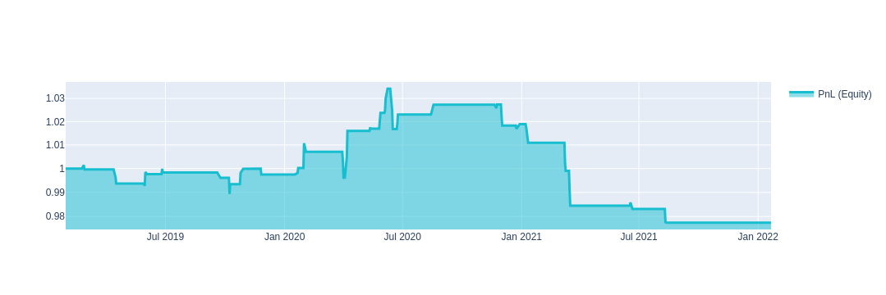

# О платформе

**QuantNet** — компания, которая занимается исследованиями и разработкой торговых стратегий для финансовых рынков.

Мы **предлагаем** пользователям
* **принять участие в розыгрыше 500 тысяч рублей за квартал**, отправив стратегии в соревнования.
* открытые инструменты для выгрузки **данных** с финансовых **бирж**.
* открытые инструменты для **создания** торговых **стратегий**. Вы можете **применить их для частной торговли**.
* **протестировать** любую финансовую **идею**.
* дружественное и **быструю обратную связь** от комьюнити и нас в vk, Telegram.

Библиотеки и инструменты написаны на **python**. 
Разработку стратегий можно вести в **Jupyter Notebook** или **Jupyter lab**. **Мы вам даём инстансы до 8 гб оперативной памяти на каждую стратегию.** 
Посмотрите пример, который демонстрирует простоту создания торговых стратегий.

# Начало работы

**Необходимые условия**
* [Зарегистрируйтесь](https://quantnet.ai/personalpage/registration) на платформе
* Откройте вкладку стратегии в разработке.
* Нажмите создать стратегию или скопируйте любой шаблон готовых стратегий.

Ниже приведены основные шаги, присутствующие в большинстве стратегий.
[скопировать стратегию целиком](#)

## 1. Подготовка
Сначала нужно подготовить рабочее пространство - загрузить данные и библиотеки
```python
import xarray as xr
import numpy as np
import pandas as pd

import qnt.data    as qndata
import qnt.stepper as qnstepper
import qnt.stats   as qnstats
import qnt.graph   as qngraph
import qnt.forward_looking as qnfl

data = qndata.load_data(min_date = "2017-01-01",
                        max_date = None,
                        dims     = ("time", "field", "asset"))
```

" data "- это xarray.DataArray, который содержит исторические данные. Например, 
мы хотим получить цены открытия и закрытия акций Apple:

```python
apple_close = data.loc[::, "close", "NASDAQ:AAPL"]
apple_open = data.loc[::, "open", "NASDAQ:AAPL"]

# you can also work with pandas:
# apple_close = data.loc[::, "close", :].to_pandas()["NASDAQ:AAPL"]
```

Таблицу доступных данных можно посмотреть [здесь](user_guide/data.md). Некоторые другие данные:
```python
all_close = data.loc[::, "close", :]
all_open = data.loc[::, "open", :]
liquid = data.loc[::, "is_liquid", :]
```
Liquid это true/false xarray DataArray. Значение True в конкретный день для конкретной компании означает что акция входит в топ 500 ликвидных акций за последний месяц.


## 2. Распределение весов
Предположим, у нас есть торговая идея - инвестировать больше, если цена открытия низкая. Другими словами, мы хотим что бы каждый день происходило переспраделение капитала между инструментами портфеля пропорционально формуле:

```math
\frac{1}{open_i}
```
где индекс i отвечает за конкретную акцию ([здесь](/data/market.md) содержится подробное описание алгоритмической торговли).

Мы можем распределить капитал, присваивая веса инструментам портфеля:
```python
weights = 1/all_open
```

Вы можете реализовать и протестировать любую идею. Некоторые другие примеры:
```python
# buy all positions: weights = all_open/all_open
# sell all positions: weights = -all_open/all_open
# the more price change, the more we buy = (all_close - all_open)/all_open
```

Обратите внимание, что мы торгуем только ликвидными акциями. Можно сформировать выходные веса:

```python
output = weights*liquid

# If you worked with pandas and weigths is pandas.Dataframe:
# output = xr.DataArray(weights.values, dims = ["time","asset"], coords= {"time":weights.index,"asset":weights.columns} )
```

## 3. Оценка эффективности
После того, как мы построили алгоритм, нам нужно его оценить. Для начала нам нужно рассчитать статистику.
```python
stat = qnstats.calc_stat(data, output)
display(stat.to_pandas().tail())
```

Результаты алгоритма, рассчитанные на исторических данных, 
обычно представлены на [графике прибыли (equity)](/intro/rr.md) чтобы понять поведение совокупной прибыли:

```python
performance = stat.to_pandas()["equity"]
qngraph.make_plot_filled(performance.index, performance, name="PnL (Equity)", type="log")
```



Мы используем набор [критериев](/quality/rules.md) для оценки производительности. 
Вы можете отправить свой алгоритм и принять участие в соревнованиях, если он пройдет все [фильтры](/quality/major.md).

Например, в соответствии с правилами, Sharpe должен быть больше 1 за последние 3 года; корреляция с другими стратегиями должна быть меньше 90%:
```python
display(stat[-1:].sel(field = ["sharpe_ratio"]).transpose().to_pandas())
qnstats.print_correlation(output, data)
```

## 4. Отправка стратегии

Если вы достаточно удовлетворены своим алгоритмом и он соответствует всем требованиям, вы можете отправить его.
```python
qnstepper.write_output(output)
```

На этом этапе код готов к отправке. Просто нажмите на кнопку отправки на странице вашего аккаунта, и мы оценим вашу стратегию на наших серверах!

[Скопировать стратегию целиком](#)

Не забудьте [зарегистрироваться на платформе](https://quantnet.ai/personalpage/registration)

Пока мы лишь кратко представили самые основные возможности платформы **QuantNet** — остаток этого руководства посвящён более детальному рассмотрению этих и других возможностей.
