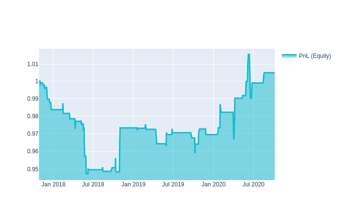

## О платформе

**QuantNet** — компания, которая занимается разработкой инструментов для создания торговых стратегий.

> Мы **предлагаем** пользователям:
* участвовать в розыгрыше **500 тысяч рублей каждый квартал**, отправив стратегии в <a href='/contest' target='_blank'>соревнования</a>;
* протестировать финансовые идеи. Вы можете применить их для частной торговли;
* дружественное комьюнити и быструю обратную связь  в <a href='https://vk.com/quantnetrussia' target='_blank'>vk</a>, <a href='https://t.me/quantnetrussia' target='_blank'>Telegram</a>.

> Мы **предоставляем**:
* среду для разработки Jupyter Notebook или JupyterLab; 
* инстансы до 8 гб оперативной памяти на каждую стратегию; 
* <a href='https://github.com/qntnet/data-relay' target='_blank'>открытые инструменты</a> для выгрузки данных с финансовых бирж;
* <a href='https://github.com/qntnet/qnt-python' target='_blank'>открытые инструменты</a> для создания торговых стратегий;
* примеры стратегий.


<p class="tip">Необходимые условия:</p>

* <a class="tip" href='/personalpage/registration' target='_blank'>зарегистрируйтесь на платформе;</a>
* <a class="tip" href='/personalpage/strategies' target='_blank'>откройте вкладку стратегии в разработке;</a>
* нажмите **создать стратегию** или **скопируйте** любой **шаблон** готовых стратегий.

> Ниже приведены пример стратегии и пошаговый её разбор.

## Разбор стратегии

### Полный код

> Идея стратегии. Цена текущего дня минус цена предыдущего дня у топ 500 ликвидных инструментов. Получившиеся изменения возьмём как веса активов в портфеле.

```python
import qnt.data as qndata
import qnt.stats as qnstats
import qnt.stepper as qnstepper
import qnt.exposure as qne
import datetime as dt

data = qndata.load_data(
    tail=dt.timedelta(days=3 * 365),
    forward_order=True)

price_open = data.sel(field="open")
price_open_one_day_ago = price_open.shift(time=1)

strategy = price_open - price_open_one_day_ago

weights = strategy * data.sel(field="is_liquid")
weights = weights / abs(strategy).sum('asset')
weights = qne.drop_bad_days(weights)

statistics = qnstats.calc_stat(data, weights)

qnstats.print_correlation(weights, data)
qnstats.check_exposure(weights)

qnstepper.write_output(weights)
```

### 1. Подготовка
Сначала нужно подготовить рабочее пространство - загрузить данные и библиотеки
```python
import qnt.data as qndata
import qnt.stats as qnstats
import qnt.stepper as qnstepper
import qnt.exposure as qne
import datetime as dt

data = qndata.load_data(
    tail=dt.timedelta(days=3 * 365),
    forward_order=True)
```

" **data** "- это xarray.DataArray, который **содержит исторические данные** за последние 3*365 дней. 
Таблицу доступных данных можно посмотреть [здесь](user_guide/data.md). 

**Получить цены открытия** за сегодня и вчера:

```python
price_open = data.sel(field="open")
price_open_one_day_ago = price_open.shift(time=1)
```

### 2. Распределение весов
> Торговый алгоритм использует финансовые данные для формирования весов, пропорционально которым распределяется капитал. 

**Положительный** вес означает длинную позицию (**покупку**), **отрицательное** значение - короткую (**продажу**).

<p class="tip">На каждую дату алгоритм считает какие веса портфеля должны быть на открытии торгов следующего дня.</p>

Распределим капитал, как **разницу** между ценами за сегодняшний и вчерашний день:
```python
strategy = price_open - price_open_one_day_ago
```

Будем торговать топ 500 **ликвидными компаниями**:
```python
weights = strategy * data.sel(field="is_liquid")
```

**data.sel(field='is_liquid')** это true/false xarray DataArray. Значение **True** в конкретный день для конкретной компании означает, что **акция входит в топ 500** ликвидных акций за последний месяц.


**Нормируем %** от капитала по всем компаниям:
```python
weights = weights / abs(strategy).sum('asset')
```

**Удалим** из торговли дни, когда стратегия имеет **большой финансовый риск**. [Подробнее](/reference/evaluation.md)
```python
weights = qne.drop_bad_days(weights)
```

### 3. Оценка эффективности
После того, как мы построили алгоритм, нам нужно его **оценить**. Для начала нам нужно **рассчитать статистику**.
```python
statistics = qnstats.calc_stat(data, weights)
display(statistics.to_pandas().tail())
```

Результаты алгоритма, рассчитанные на исторических данных, 
обычно представлены на [графике прибыли (equity)](/intro/rr.md) чтобы понять поведение совокупной прибыли:

```python
import qnt.graph   as qngraph
performance = statistics.to_pandas()["equity"]
qngraph.make_plot_filled(performance.index, performance, name="PnL (Equity)", type="log")
```



Мы используем набор [критериев](/quality/rules.md) для оценки производительности. 
Вы можете отправить свой алгоритм и принять участие в соревнованиях, если он пройдет все [фильтры](/quality/major.md).

Например, в соответствии с правилами, Sharpe должен быть больше 1 за последние 3 года; корреляция с другими стратегиями должна быть меньше 90%:
```python
display(statistics[-1:].sel(field = ["sharpe_ratio"]).transpose().to_pandas())
qnstats.print_correlation(weights, data)
qnstats.check_exposure(weights)
```
Ваши стратегии должны инвестировать менее 5% капитала (инвестируемого) в какой-либо один актив.  [Подробнее](/reference/evaluation.md) 
```python
qnstats.check_exposure(weights)
```

### 4. Отправка стратегии

Если вы достаточно удовлетворены своим алгоритмом и он соответствует всем требованиям, вы можете отправить его.
```python
qnstepper.write_output(weights)
```

На этом этапе код готов к отправке. Просто нажмите на кнопку отправки на странице вашего аккаунта, и мы оценим вашу стратегию на наших серверах!


Не забудьте [зарегистрироваться на платформе](https://quantnet.ai/personalpage/registration)

Пока мы лишь кратко представили самые основные возможности платформы **QuantNet** — остаток этого руководства посвящён более детальному рассмотрению этих и других возможностей.
