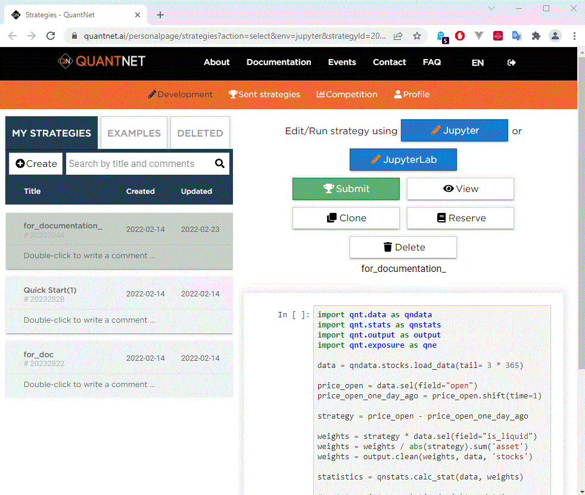
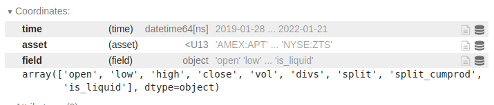
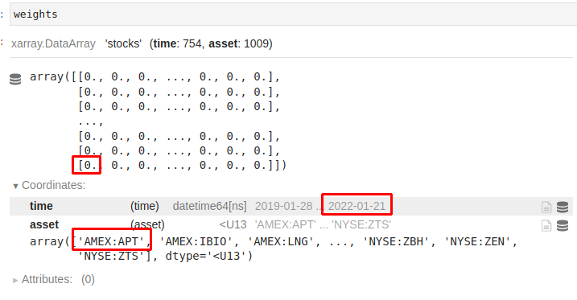
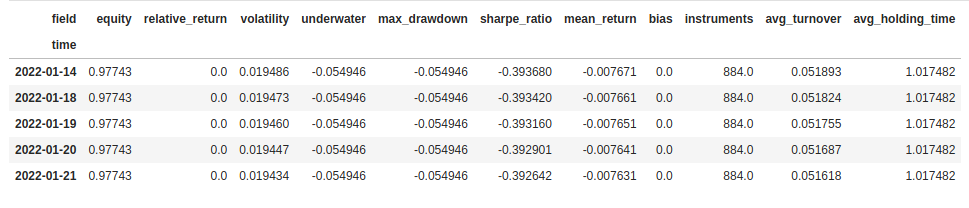
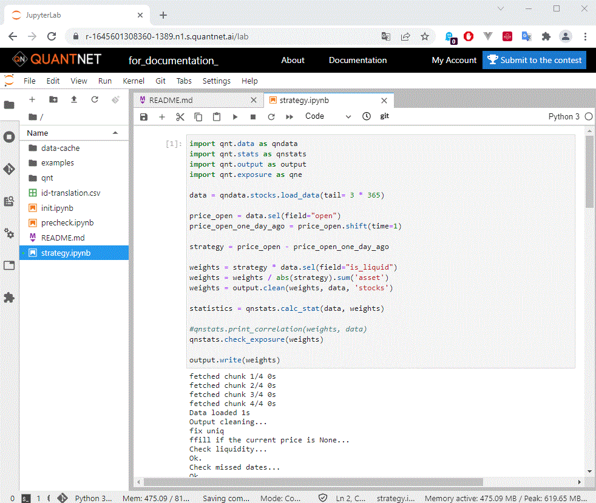

## О платформе

**QuantNet** — компания, которая разрабатывает инструменты для создания торговых стратегий.

С 2019 года организуем <a href='/contest' target='_blank'>конкурсы</a> по предсказанию финансового рынка.
**Выплаченный** призовой **фонд** больше **4,8 млн.** рублей.


> Предлагаем пользователям:

* участвовать в розыгрыше **500 тысяч рублей каждый квартал**, отправляя стратегии в <a href='/contest' target='_blank'> соревнования</a>;
* протестировать финансовые идеи;
* дружественное комьюнити и быструю обратную связь в <a href='https://vk.com/quantnetrussia' target='_blank'>vk</a> и <a href='https://t.me/quantnetrussia' target='_blank'>Telegram</a>.

> Предоставляем:

* python среду для разработки **Jupyter Notebook** или **JupyterLab**;
* <a href='https://github.com/qntnet/qnt-python' target='_blank'>открытую библиотеку</a> для создания торговых стратегий;
* инстансы до 8 гб оперативной памяти на каждую стратегию;
* **финансовые данные**: акции, фьючерсы, криптовалюта, товарный рынок, макроэкономические данные, фундаментальные данные компаний;
* средства оптимизации торговых стратегий;
* возможность оффлайновой разработки алгоритмов на своем ПК;
* примеры стратегий.

<p class="tip">Необходимые условия:</p>

* <a class="tip" href='/personalpage/registration' target='_blank'>зарегистрируйтесь на платформе;</a>
* <a class="tip" href='/personalpage/strategies' target='_blank'>откройте вкладку стратегии в разработке;</a>
* нажмите **создать стратегию** или скопируйте **шаблон** готовой стратегий.

> Ниже приведены пример стратегии и пошаговый её разбор.



## Разбор стратегии

### Пример

> Идея стратегии: цена открытия текущего дня минус цена открытия предыдущего дня у топ 500 ликвидных акций c NASDAQ и NYSE.
>
> Включим в портфель акции пропорционально изменениям цен.

Чем больше акция выросла за день, тем больше её доля в портфеле.

```python
import qnt.data as qndata
import qnt.stats as qnstats
import qnt.output as output
import qnt.exposure as qne

data = qndata.stocks.load_data(tail=3 * 365)

price_open = data.sel(field="open")
price_open_one_day_ago = price_open.shift(time=1)

strategy = price_open - price_open_one_day_ago

weights = strategy * data.sel(field="is_liquid")
weights = weights / abs(strategy).sum('asset')
weights = output.clean(weights, data, 'stocks')

statistics = qnstats.calc_stat(data, weights)

qnstats.print_correlation(weights, data)
qnstats.check_exposure(weights)

output.write(weights)
```

### 1. Подготовка

Сначала нужно подготовить рабочее пространство - загрузить данные и библиотеки:

```python
import qnt.data as qndata
import qnt.stats as qnstats
import qnt.output as output
import qnt.exposure as qne

data = qndata.stocks.load_data(tail=3 * 365)
```



**data** - это `xarray.DataArray`, который содержит исторические данные за последние 3*365 дней:

* **time**: дата в формате yyyy-mm-dd;
* **field**: атрибут, например цена открытия;
* **asset**: идентификационный символ актива, например NASDAQ:AAPL для акций Apple.

Таблицу доступных данных можно посмотреть [здесь](user_guide/data.md).

**Получить цены** открытия за сегодня и вчера:

```python
price_open = data.sel(field="open")
price_open_one_day_ago = price_open.shift(time=1)
```

### 2. Распределение весов

Бэктестер основан на экспозиции. Алгоритм торговли должен определять доли капитала, которые будут распределены по активам (веса распределения).
**Положительный** вес означает длинную позицию (**покупку**), **отрицательное** значение - короткую (**продажу**).

> Торговый алгоритм использует финансовые данные для формирования весов, пропорционально которым распределяется капитал.

<p class="tip">На каждую дату алгоритм считает какие веса портфеля должны быть на открытии торгов следующего дня.</p>

Распределим капитал, как **разницу** между ценами за сегодняшний и вчерашний день:

```python
strategy = price_open - price_open_one_day_ago
```

Будем торговать топ 500 **ликвидными компаниями**:

```python
weights = strategy * data.sel(field="is_liquid")
```

`data.sel(field='is_liquid')` это true/false xarray.DataArray. Значение **True** в конкретный день для конкретной компании означает, что **акция входит в топ 500** ликвидных акций за последний месяц.

**Нормируем %** от капитала по всем компаниям:

```python
weights = weights / abs(strategy).sum('asset')
```

Удалим из торговли дни, в которых стратегия имеет **большой финансовый риск**.
[Подробнее](/reference/evaluation.md)

```python
weights = output.clean(weights, data, 'stocks')
```

Вот как будет выглядеть массив весов. Для каждого торгового дня указан вес по каждому активу, соответствующий тому, сколько капитала будет распределено по этому активу в длинной (**положительный** вес) или
короткой (**отрицательный** вес) позиции.



В этом примере мы выделили **0** для **AMEX:APT 2022-01-21**.

В результирующем наборе две координаты:

* **time**: веса определяются для каждого торгового дня;
* **asset**: каждый вес соответствует желаемому размеру позиции по конкретному активу.

### 3. Оценка эффективности

**Оценим** получившийся алгоритм. Для начала нам нужно **рассчитать статистику**.

```python
statistics = qnstats.calc_stat(data, weights)
display(statistics.to_pandas().tail())
```



Параметры оценки алгоритмов:

* **equity**: совокупная стоимость прибыли и убытков с момента запуска стратегии. Стартовое значение 1 млн USD;
* **relative_return**: относительное ежедневное изменение **equity**;
* **volatility**: волатильность инвестиций с момента запуска стратегии. Годовое стандартное отклонение relative_return;
* **underwater**: текущая просадка (убыток) стратегии;
* **max_drawdown**: максимальная просадка стратегии;
* **sharpe_ratio**: годовой коэффициент шарпа с момента запуска стратегии. Для участия в конкурсах значение должно быть больше 1.
* **mean_return**: среднегодовая доходность инвестиций;
* **bias**: дневная асимметрия между длинной и короткой позицией: 1 только long, -1 только short;
* **instruments**: количество торгуемых финансовых инструментов;
* **avg_turnover**: средний оборот;
* **avg_holding_time**: среднее время удержания позиции в днях.

Подробное объяснение можно найти в исходном коде библиотеки `/qnt/stats.py`.

Результаты алгоритма, рассчитанные на исторических данных, удобно представлять на [графике прибыли (equity)](/intro/rr.md), чтобы понять поведение совокупной прибыли:

```python
import qnt.graph   as qngraph

performance = statistics.to_pandas()["equity"]
qngraph.make_plot_filled(performance.index, performance, name="PnL (Equity)", type="log")
```


Мы используем набор [критериев](/quality/rules.md) для оценки производительности. Вы можете отправить свой алгоритм и принять участие в соревнованиях, если он пройдет все [фильтры](/quality/major.md).

Например, в соответствии с правилами, Sharpe должен быть больше 1 за последние 3 года; корреляция с другими стратегиями должна быть меньше 90%:

```python
display(statistics[-1:].sel(field=["sharpe_ratio"]).transpose().to_pandas())
qnstats.print_correlation(weights, data)
qnstats.check_exposure(weights)
```

Ваши стратегии должны инвестировать менее 5% инвестируемого капитала в какой-либо один актив.
[Подробнее](/reference/evaluation.md)

```python
qnstats.check_exposure(weights)
```

### 4. Отправка стратегии

Перед отправкой стратегии в конкурс добавьте в код сохранение весов:

```python
output.write(weights)
```

Стратегию можно отправить в конкурс: 

* нажав на кнопку **"Submit to the contest"** в Jupyter Notebook или JupyterLab;
* в личном кабинете в разделе разработка. Кнопка **"Отправить"**.



После отправки, стратегия появиться на вкладке "Отправленные стратегии" и попадёт в очередь для расчёта финансовых результатов.

Цель этого раздела - кратко представить основные возможности платформы **QuantNet**. 
Рекомендуем [зарегистрироваться](https://quantnet.ai/personalpage/registration) и попробовать платформу, запустив код готовых примеров, это бесплатно и без смс.


## Вебинар о платформе

[Вебинар о сервисе тестирования стратегий QUANTNET. Соревнование для алготрейдеров и программистов](https://youtu.be/g8dpROn4o_E?t=2)

<iframe width="100%" height="515" src="https://www.youtube.com/embed/g8dpROn4o_E?start=2" title="YouTube video player" frameborder="0" allow="accelerometer; autoplay; clipboard-write; encrypted-media; gyroscope; picture-in-picture" allowfullscreen></iframe>