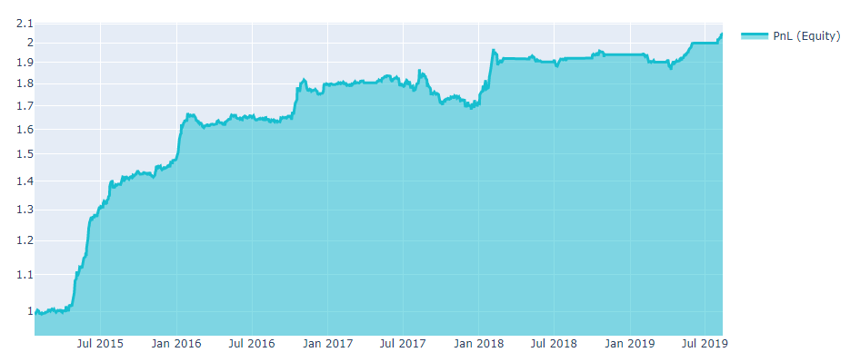
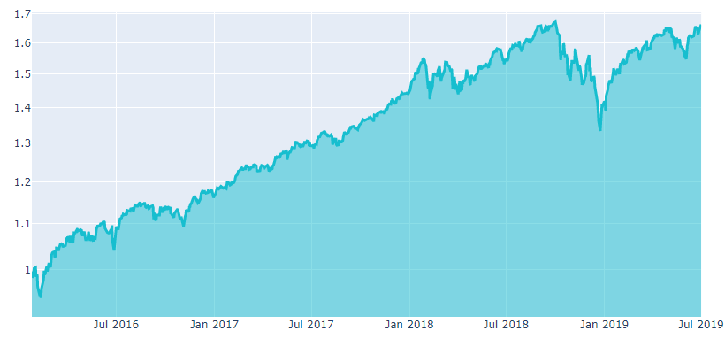
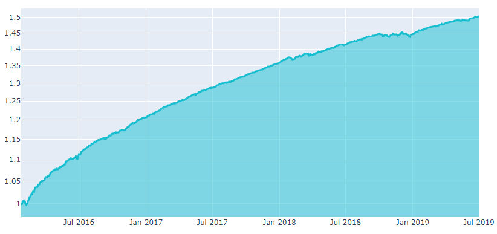
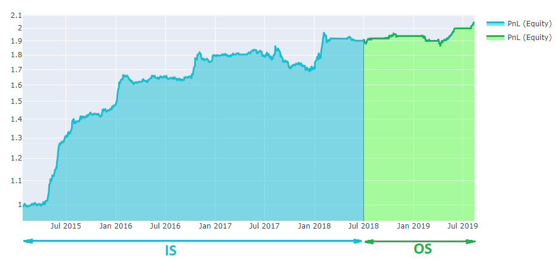
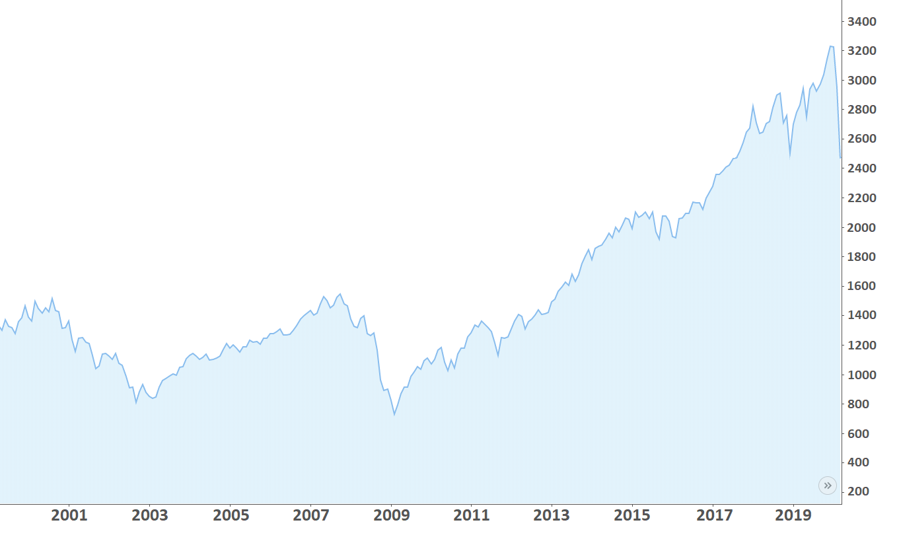

# Алгоритмическая торговля

\"Алгоритмическая торговля - это процесс исполнения ордеров с
использованием автоматических и предварительно запрограммированных
торговых инструкций для учета таких переменных, как цена, время и
объем.\" - Investopedia.

## Введение

Алгоритмическая торговля означает, что решение о покупке или продаже
финансовых ценных бумаг на бирже принимается на основе заранее
определенного алгоритма. На нашей платформе алгоритм - это скрипт на
python, который принимает исторические данные в качестве входных данных
и дает решение о покупке/продаже акции.

Скажем, у нас есть капитал в размере \$1 млн., необходимо сформировать
инвестиционный портфель из трех инструментов: Apple Inc (AAPL), Alphabet
Inc класса C (GOOG), Tesla Inc (TSLA). Давайте посмотрим на цену *open*
этих акций за определенный период. *Open* - цена, по которой ценные
бумаги впервые торгуются после открытия биржи в торговый день. Мы
используем исторические данные биржи NASDAQ в качестве входных данных:

| date         | AAPL   | GOOG     | TSLA   |
|:------------:| ------:| --------:| ------:|
| Mar 02, 2020 | 282.28 | 1,351.61 | 711.26 |
| Mar 03, 2020 | 303.67 | 1,399.42 | 805.00 |
| Mar 04, 2020 | 296.44 | 1,359.23 | 763.96 |

_Таблица 1. Цена акций (в USD) на момент открытия биржи NASDAQ._

Теперь нам нужно придумать алгоритм, по которому капитал будет
распределяться между акциями. Алгоритм представляет собой найденную
закономерность, сигнал о событиях, происходящих в мире и отображающихся
в исторических данных.

Предположим, у нас есть гипотеза - нужно вкладывать больше, если цена
*open* низкая. Гипотеза может быть выражена формулой:

```math
\label{alpha1}
    \frac{1}{\textbf{open}},
```

Здесь и далее мы будем выделять вектора жирным шрифтом. Если применить эту
формулу к таблице 1, получится матричный вид алгоритма:

| date         | AAPL          | GOOG          | TSLA          |
|:------------:| -------------:| -------------:| -------------:|
| Mar 02, 2020 | 0.00354258183 | 0.00073985839 | 0.00140595562 |
| Mar 03, 2020 | 0.00329304837 | 0.00071458175 | 0.00124223602 |
| Mar 04, 2020 | 0.00337336391 | 0.00073571065 | 0.00130896905 |

_Таблица 2. Матричный вид алгоритма._

Капитал распределяется пропорционально значениям матрицы. Чтобы получить
доли капитала, вложенного в каждый инструмент, матрица (таблица 2) должна быть 
нормализована (норма ``$` l_1 `$``) на единицу для каждого дня:

| date         | AAPL   | GOOG   | TSLA   |
|:------------:| ------:| ------:| ------:|
| Mar 02, 2020 | 0.6228 | 0.1301 | 0.2472 |
| Mar 03, 2020 | 0.6273 | 0.1361 | 0.2366 |
| Mar 04, 2020 | 0.6226 | 0.1358 | 0.2416 |

_Таблицы 3. Веса алгоритма (__weights__)._

Таким образом, 2 марта 2020 года для AAPL было выделено
``$` $1M \cdot 0.6228 = $622,800; `$`` GOOG и TSLA получили $130,100 и
$247,200  соответственно. Матричные значения (Таблица 3) называются весами (**weights**) алгоритма.


## Длинная позиция & короткая позиция

Чтобы продать акцию, нужно просто присвоить ей отрицательный вес в
алгоритме. Предположим, у вас есть следующие веса:

|date          | AAPL | GOOG | TSLA |
| ------------ | ---- | ---- | ---- |
| Mar 02, 2020 | 0.4  |  0.4 | -0.2 |


Положительное значение соответствует длинной позиции (покупаем акции);
отрицательное значение соответствует короткой позиции (продаем акции).
Таким образом, капитал $1M будет выделен в следующих пропорциях:
$400,000 для AAPL; $400,000 для GOOG; $-200,000 для TSLA.

**Детали**

В нашей платформе мы используем упрощенное представление короткой
позиции: это обратное действие к длинной позиции. Для торговли в
реальных условиях нужно помнить, что короткие позиции связаны с более
высокими рисками. Инвестор, продающий акции, которыми он еще не владеет
(как правило, продаёт со счета своего брокера), обязан выкупить их через
некоторое время. Таким образом, инвестор ожидает падения цен и играет
против рынка. Это приводит к следующим рискам:

-   Некоторые акции трудно заимствовать. Причина - высокий спрос,
    ограниченное количество ценных бумаг и т.д. За короткую позицию по
    таким ценным бумагам брокер взимает дополнительную комиссию.

-   Держатель коротких позиций несет ответственность за выплату
    дивидендов по акциям лицу, у которого они были заимствованы.

-   Потенциальные потери при короткой позиции могут быть бесконечными,
    поскольку теоретически максимальная цена акций не ограничена. С
    другой стороны, цена акций не опустится ниже нуля, поэтому
    максимальная прибыль ограничена.

-   Даже если оценка верна, момент может быть неподходящим. Крайне
    невыгодно долго держать короткую позицию по растущей цене.
    
    

## Относительная доходность

Инвестиционный портфель перераспределяется согласно алгоритму один раз в
день (у биржи примерно 252 рабочих дня в году). Перераспределение
происходит в начале дня. Для нашей платформы мы предполагаем, что
покупка акций происходит по цене открытия биржи (*open*).

Капитал растет, если прогноз изменения цен был верен. Ежедневное
изменение капитала оценивается в конце торгового дня и сильно зависит от
цены *close*. *Close* - цена, по которой ценные бумаги в последний раз
торговались в конкретный день.


Результаты алгоритма, рассчитанные на исторических данных, обычно
представляют на графике (рис. 1), чтобы понять поведение совокупной прибыли (equity).
В нашей платформе мы устанавливаем начальный капитал равным 1, чтобы его
можно было легко масштабировать на начальный капитал.


_Рис. 1_


Относительная доходность (relative returns) просто показывает как
изменился капитал. Для i-ого дня мы вводим относительную доходность (rr)
в долях единицы:

```math
\label{equity1}
    \text{rr}[i] = \frac{\text{equity}[i]}{\text{equity}[i-1]} - 1,
```

**Детали**

Иногда важно понять, как рассчитывается совокупная прибыль (equity,
PnL). Скажем, мы распределяем наш капитал пропорционально вектору
*weights* для i-ого дня. Таким образом, мы покупаем акции по цене *open*
и получаем следующие позиции:

```math
\label{position}
    \textbf{pos}[i] = \left( \textbf{weights}[i]\cdot\text{equity}[i] \right)/\textbf{open}[i],
```

где переменные, выделенные жирным шрифтом, это вектора с весами для
каждого инструмента в портфеле; деление производится поэлементно. На
следующий день алгоритм сгенерирует новый вектор ``$` \textit{weigths}[i + 1] `$``,
который перераспределит наш капитал на новые
позиции. Перераспределение инструментов портфеля приводит к потерям
капитала, связанным, главным образом, с комиссией брокера и
проскальзыванием (*slippage*).

Совершенно очевидно, что чем большую часть капитала мы должны
перераспределить, тем больше комиссия брокера влияет на нашу прибыль.
Однако для реальной торговли проскальзывание оказывает более
существенное влияние на прибыль, чем комиссия, поэтому в нашей платформе
мы учитываем только проскальзывание.

Что такое проскальзывание? Для покупки/продажи акций нужен
продавец/покупатель. Если на бирже нет предложения, ордер открывается по
новой цене. Таким образом, мы покупаем нужное количество акций по
частям, используя предложения о покупке/продаже определенного количества
акций по определенной (изменяющейся) цене. Мы вычисляем проскальзывание
(*slippage*) по следующей формуле:

```math
\label{slappage}
    \text{slippage}[i] = abs(\textbf{pos}[i] - \textbf{pos}[i-1])\cdot \textbf{ATR}(14) \cdot 0.05,
```
где ``$` \textbf{ATR}(14) `$`` - индикатор волатильности рынка. Индикатор
Average True Range (``$` \textbf{ATR}(N) `$``) представляет собой скользящую
среднюю (MA) значений истинного диапазона (**TR**) за N дней:

```math
\begin{gathered}
\label{ATR}
    \textbf{TR}[i] = max(
\textbf{high}[i] - \textbf{low}[i]; \textbf{high}[i] - \textbf{close}[i-1]; \textbf{close}[i-1] - \textbf{low}[i]), \end{gathered}
```

```math
\label{ATR2}
    \textbf{ATR}(N) = MA(\textbf{TR},N).
```

Теперь мы можем ввести формулу расчета капитала для i-ого дня:

```math
\begin{gathered}
    \text{equity}[i] = \text{equity}[i - 1] + (\textbf{open}[i] - \textbf{close}[i-1]) \cdot \\ \textbf{pos}[i-1] + (\textbf{close}[i] - \textbf{open}[i]) \cdot \textbf{pos}[i] - \text{slippage}[i]
    \label{equity}\end{gathered}
```

## Качество алгоритма
------------------

  После того, как мы сконструировали алгоритм и построили график на
исторических данных, необходимо использовать набор критериев для оценки
качества алгоритма. Все актуальные правила соревнований доступны
[здесь](https://quantnet.ai/contest).

### Sharpe Ratio

Чтобы оценить прибыльность алгоритма, мы в первую очередь измеряем
Sharpe Ratio (SR). Это наиболее важный и широко используемый показатель.
Для нашей платформы мы используем годовой SR и предполагаем, что в году
в среднем 252 торговых дня. Годовая формула SR представлена ниже:

```math
\label{SR_final_first}
    \text{SR} = \frac{\sqrt[N]{[\prod\limits_{i=1}^{N} (rr_i + 1)]^{252}} - 1}{\sqrt{\frac{252}{N}\sum\limits_{i=1}^{N} (rr_{i}  - \overline{rr}) }},
```

где ``$` rr_i `$`` - дневная относительная доходность (за i-день),
``$`\overline{rr}`$`` - среднее значение.

Числитель - это среднесуточный доход. В нашем случае размер торгуемого
капитала (book size) - это весь совокупный доход (equity), поэтому
среднесуточный доход считается как геометрическое среднее.

Знаменатель - это стандартное отклонение доходности портфеля.
Знаменатель можно воспринимать как волатильность.

Таким образом, Sharpe ratio - это доход на единицу риска
(волатильность). Чем больше Sharp ratio, тем лучше (Рис.1).
Для успешной отправки алгоритма, показатель SR должен быть больше 1 за
последние 3 года.



Рис 1. Графики акций для разных алгоритмов. Верхний график: ``$` \text{SR} = 1.28 `$``.
Нижний график: ``$` \text{SR} = 7.62 `$``


**Детали**

В 1994 William Sharpe определил Sharpe ratio следующим образом:

```math
\label{SR_1}
    \text{SR} = \frac{E(R_p - R_f)}{\sigma_p},
```
    
где ``$` R_p `$`` - доходность

портфеля, ``$` R_f `$`` - безрисковая ставка, ``$` E(R_p - R_f) `$`` - ожидаемое
значение превышения доходности портфеля над эталонной доходностью,
``$` \sigma_p `$`` - стандарт отклонение избыточной доходности портфеля. Мы
полагаем, что безрисковая ставка равна нулю (альтернативный способ
вычисления SR - установить общую прибыль S&P 500 как безрисковую
ставку). За N торговых дней:
 
```math
 \label{SR_2}
    \text{SR} = \frac{\text{average daily return}}{\text{daily volatility}} = \frac{\sqrt[N]{\prod\limits_{i=1}^{N} (rr_i + 1)} - 1}{\sqrt{\frac{1}{N}\sum\limits_{i=1}^{N} (rr_{i}  - \overline{rr}) }},
```

где ``$` \overline{rr} `$`` - ожидаемое значение относительной доходности. В
нашем случае размер торгуемого капитала (book size) - это весь
совокупный доход (equity), поэтому числитель является геометрическим
средним. Теперь введем SR, масштабированный на произвольный период ``$` T `$``:

```math
\label{SR_final}
    \text{SR} = \frac{\sqrt[N]{[\prod\limits_{i=1}^{N} (rr_i + 1)]^T} - 1}{\sqrt{\frac{T}{N}\sum\limits_{i=1}^{N} (rr_{i}  - \overline{rr}) }}.
```

Для годового Sharpe ratio можно указать ``$` T = 252 `$`` торговых дня в году.
Мы используем годовой Sharpe ratio для оценки алгоритмов на нашей платформе.


### Уникальность

Каждый хороший торговый алгоритм - это сигнал, который отражает
несовершенство рынка. Чем больше капитала задействовано в сигнале, тем
меньше маржинальность в процентном выражении. Необходимо минимизировать
пересечение алгоритма с известными и уже существующими сигналами.
Уникальность можно определить как максимальную корреляцию алгоритма с
пулом существующих на платформе алгоритмов: 

```math
r_{XY} = \frac{\text{cov}_{\textbf{X}\textbf{Y}}}{\sigma_{\textbf{X}} \sigma_{\textbf{Y}}} = \frac{\sum (\textbf{X} - \overline{\textbf{X}})(\textbf{Y} - \overline{\textbf{Y}})}{\sqrt{\sum (\textbf{X} - \overline{\textbf{X}})^2(\textbf{Y} - \overline{\textbf{Y}})^2}}
```

где ``$` \textbf{X}, \textbf{Y} `$`` - ежедневные относительные доходы. 
Чем ниже корреляция, тем лучше. Согласно правилам, ваш алгоритм должен иметь
коэффициент корреляции ниже 0.9 за последние 3 года; в противном
случае, вам нужно иметь наибольший Sharpe ratio среди коррелирующих
алгоритмов.

### Диверсификация рисков

Неразумно полагаться на одну-две компании при написании алгоритма. В
таком случае, даже если стратегия верна, непредсказуемые мировые
события/новости могут нанести непоправимый ущерб инвестиционному
портфелю (Например,
[1](https://www.ft.com/content/be040b3a-5c96-11ea-b0ab-339c2307bcd4) и
[2](https://www.themoscowtimes.com/2020/03/06/russias-tinkoff-bank-shares-fall-as-founder-indicted-in-us-a69538)).

Хороший способ диверсифицировать риски - увеличить количество
инструментов в инвестиционном портфеле. После этого мы можем *maximum
stock weight* сделать равным 0.05. Это означает, что мы будем выделять не
более 5% нашего капитала на каждый инструмент в портфеле. 

Каждый год таких новостей много. Они сливаются с информационным шумом, и
мы их забываем. Однако они отражаются в исторических данных, а так же
сильно повлияют на прибыль в будущем. Согласно правилам, ваш алгоритм должен проходить [exposure filter](https://quantnet.ai/documentation/ru/available_functions/evaluation.html#exposure-filter). Можно воспользоваться предложенными [инструментами](https://quantnet.ai/documentation/ru/available_functions/improve_algorithm.html#exposures-improving) что бы исключить отсеивание алгоритма из-за exposure filter.

## Пояснения Is и Os

   При создании алгоритма довольно легко допустить переобучение. Если
 попробовать значительное количество конфигураций алгоритма, можно
 получить любой желаемый показатель на исторических данных. Для реальной
 торговли такие стратегии само собой не применимы. Ниже приведён ряд
 рекомендаций, который позволит избежать переобучения и оценить реальные
 показатели алгоритма.

**In sample**

   Под \"sample\" мы подразумеваем выборку данных. Таким образом,
 *in-sample* это наблюдаемые исторические данные, аналог учебной выборки
 для машинного обучения. Чтобы предотвратить переобучение, можно
 протестировать модель с использованием более длинной истории или
 улучшить требования к показателям в *in-sample*.

**Out of sample**

   *Out-of-sample* (ОS) является аналогом тестовой выборки в машинном
 обучении. Это данные в реальном времени. Мы берем каждый алгоритм,
 тестируем его изо дня в день в реальных условиях и отслеживаем его
 производительность.

**Competition**

   Допустим, вы участвуете в QuantNet Contest в 6-месячном соревновании
 для акций. Согласно правилам, у вас подходящий SR (> 1) и низкая
 корреляция (<0.9 за предыдущие 3 года). Тестирование за 3 года - это и
 есть *in-sample* (рис. 1). Скажем, мы измерили SR *in-sample* - SR\_IS.
 Тест в реальном времени в течение 6 месяцев называется *out-of-sample* и
 дает SR\_OS. Все стратегии оцениваются и сортируются согласно SR\_IS, SR\_OS. Чем больше, тем лучше.

 

## Улучшение алгоритма
### Нейтрализация
--------------

  Давайте проанализируем показатели акций 500 самых крупных компаний,
котирующихся на фондовых биржах США. Так называемый индекс S&P500 (рис. 1). Видно,
что в среднем рынок растёт. Доход S&P500 сильно варьируется от
нескольких процентов до более чем 20% для некоторых
[годов](https://www.cnbc.com/2017/06/18/the-sp-500-has-already-met-its-average-return-for-a-full-year.html).
Значит ли это, что просто держать длинные позиции хорошая идея?


_Рис.1_


Несмотря на рост S&P500, его Sharpe ratio менее 1. Одна из главных
причин - периодические финансовые кризисы. Вот некоторые из них:

-   1987 год. «Черный понедельник». Индекс Dow Jones упал на 22,6%.
    Причина - массовый отток инвесторов с региональных рынков.

-   2000-2003. Крах доткомов. Кризис вызван массовым вложением денег в
    интернет-проекты.

-   2007--2008. Мировой экономический кризис. Начался с ипотечного
    кризиса в США, банкротства банков и падения цен на акции, проложив
    путь мировому экономическому кризису (иногда называемому «великой
    рецессией»)

  Последствия кризисов видны на графике S&P 500 и проявляются в падении
рынка до 30%. Наивно думать, что кризис это страшные истории из
прошлого. Начало 2020 года ознаменовалось падением экономики, вызванным
коронавирусом.

Мы можем исключить влияние рынка, если уравновесим длинные и короткие
позиции для нашего алгоритма. Таким образом, суммарные инвестиции в
рынок составят $0. Нейтрализация может быть сделана для всего рынка или
для каждого сектора экономики отдельно (в целом для любой группы).
Математическая формулировка нейтрализации крайне проста.

Допустим алгоритм определил вектор весов **weights<sub>i</sub>** для i-ого дня.
Для того что бы сделать алгоритм нейтральным относительно всего рынка
(market-neutral), достаточно изменить веса алгоритма следующим образом:

**neutralized\_weights<sub>i</sub>** = **weights<sub>i</sub>** - mean(**weights<sub>i</sub>**).

Теперь среднее вектора весов для каждого дня равно нулю. Это означает,
что мы не вкладываем деньги и не выводим их с рынка.