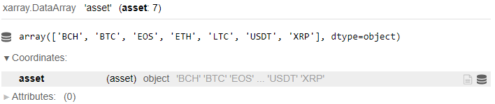
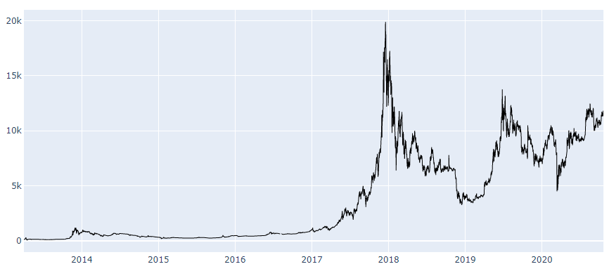

# Криптовалюта
Quantnet предоставляет актуальные данные - цена сделки и объем - для следующих криптовалют: 'BCH', 'BTC', 'EOS', 'ETH', 'LTC', 'USDT', 'XRP'. 
-------------

Выгрузим доступные данные о криптовалюте за последние 5 лет:
```python
import qnt.data    as qndata
import datetime    as dt

crypto_data = qndata.load_cryptocurrency_data(tail = dt.timedelta(days = 5*365),
                        forward_order = True)
```

Доступные криптовалюты:
```python
crypto_data.asset
```


Для каждой из них предоставлены часовые данные, содержащие **5 параметров**:
```python
crypto_data.field
```


| Наименование данных | Описание |
| ------------------ | -------- |
| open               | Open это цена, по которой криптовалюта впервые торгуются в течении соответствующего часа.|
| close              | Цена на конец часа. |
| high               | Наибольшая часовая цена. |
| low                | Наименьшая часовая цена. |
| vol                | Часовой объем торговли. Выражен в количестве криптовалют.|

Допустим нас интересует наибольшая часовая цена для BTC:

```python
BTC_high = crypto_data.sel(field = 'high').sel(asset = 'BTC')
```

Можно визуализировать данные:

```python
import plotly.graph_objs as go         # lib for charts

trend_fig = [
    go.Scatter(
        x = BTC_high.to_pandas().index,
        y = BTC_high,
        line = dict(width=1,color='black'))]
# draw chart
fig = go.Figure(data = trend_fig)
fig.update_yaxes(fixedrange=False) # unlock vertical scrolling
fig.show()
```



В [этом](https://quantnet.ai/referee/template/14015755/html) шаблоне подробно реализован метод треугольников для криптовалюты. Вы так же можете воспользоваться [пустым шаблоном](https://quantnet.ai/referee/template/13767170/html) для работы с криптовалютой.